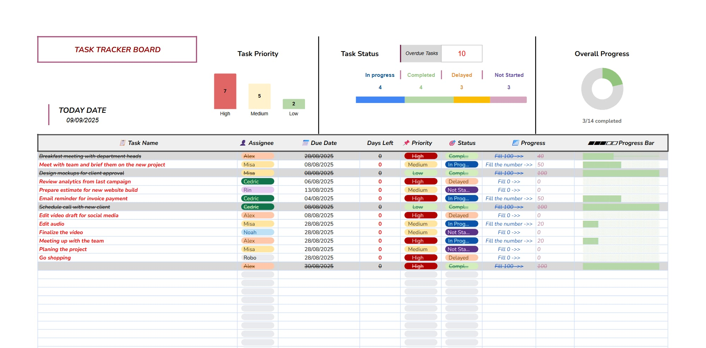

  
  
  <h1>✅ Ultimate Task Tracker & Project Board</h1>
  
  

    <b>Công cụ quản lý tiến độ dự án, theo dõi task và deadline trực quan ngay trên Google Sheets.</b>
  

  
  
  
    

  

---

## 🎯 Giới thiệu (Overview)

Bạn đang tìm cách quản lý công việc cho team mà không muốn dùng các phần mềm trả phí phức tạp? **Task Tracker Board** này được thiết kế để giải quyết vấn đề đó. 

Giao diện được tối ưu hóa để bạn nhìn vào là biết ngay dự án đang "chạy" đến đâu.

### Tính năng nổi bật (Highlights):

* 📊 **Smart Dashboard:** Tự động thống kê số lượng task theo mức độ ưu tiên (High/Medium/Low) và trạng thái.
* 🚨 **Overdue Alert:** Cảnh báo ngay lập tức số lượng task đã quá hạn (Overdue Tasks) giúp bạn xử lý kịp thời.
* 🏃 **Visual Progress Bar:** Thanh hiển thị tiến độ % ngay trong từng dòng công việc, nhìn rất trực quan.
* 👥 **Team Management:** Phân công công việc (Assignee) và theo dõi deadline dễ dàng.

---

## 📸 Giao diện chi tiết

### Dashboard & Task List
Template bao gồm các trường thông tin quan trọng:
* **Task Name & Assignee:** Ai làm việc gì?
* **Status & Priority:** Trạng thái (In Progress, Completed...) và độ ưu tiên.
* **Days Left:** Tự động đếm ngược số ngày còn lại.
* **Progress %:** Nhập % hoàn thành, thanh màu sẽ tự chạy.

---

## 🚀 Hướng dẫn cài đặt (How to use)

1.  Bấm vào nút **[Get Template Now]** màu đỏ ở trên đầu trang.
2.  Chọn **Make a copy** để lưu file về Google Drive của bạn.
3.  Bắt đầu nhập tên thành viên trong team và liệt kê công việc.

---

## 📬 Liên hệ

Nếu template này giúp ích cho bạn, hãy để lại cho mình 1 Star ⭐️ trên Github nhé!
* **Author:** [Cedric]
* **Contact:** [https://www.linkedin.com/in/quangthanh1610/]
